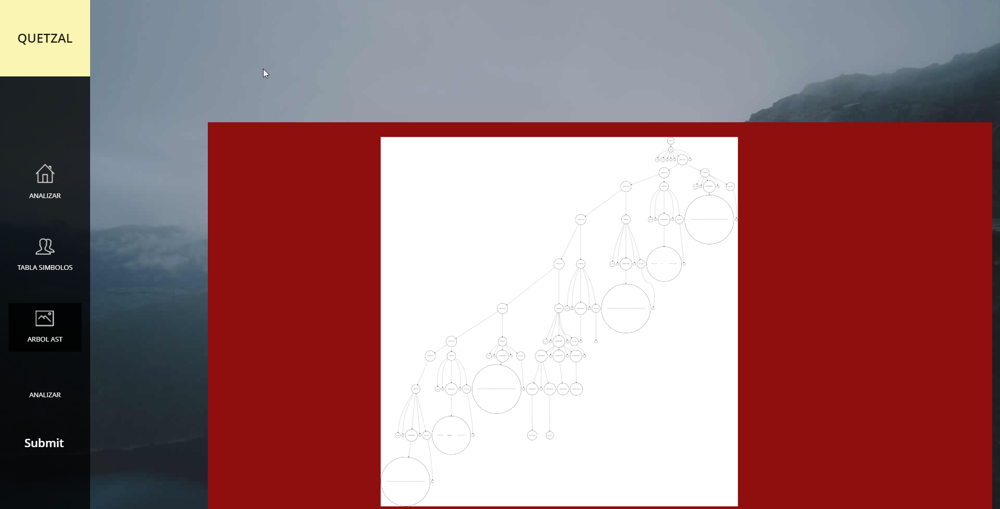

# 
Universida de San Carlos de Guatemala

## 
Facultad de ingenieria

## 
Escuela de Ciencias

## 
Organización de Lenguajes y Compiladores 2

## 
Sección A

### 
Manual Técnico

#### 
Proyecto 1

### 
Grupo No. 3

### 
Quetzal OLC2

#### Vision General:
- 
 Quetzal es un lenguaje de programación inspirado en C, su característica principal es la inclusión de tipos implícitos. El sistema de tipos de Quetzal realiza una formalización de los tipos de C y Java. Esto permite a los desarrolladores definir variables y funciones tipadas sin perder la esencia. Otra inclusión importante de Quetzal es la simplificación de los lenguajes C y Java para poder realizar diferentes instrucciones en menos pasos. Adicional Quetzal tendrá 2 flujos, se podrá interpretar el código fuente ingresado y efectuar todas sus instrucciones, o bien se puede traducir este lenguaje a un lenguaje intermedio basado en un lenguaje de 3 direcciones, este se podrá ejectuar posteriormente en cualquier compilador de C, tomando en cuenta las reglas especificas de un lenguaje de 3 direcciones

#### Objetivos:
1. Crear una pagina web básica, alojada en Git hub pages para la ejecución de la aplicación
2. Implementar una gramatica LL1 con la herramienta Jison para el análisis de los archivos de entrada
3. Construir la aplicación funcional a través de Typescript-JavaScript

#### Especificaciones:
Lenguajes y Herramientas utilizadas para el desarrrollo del proyecto-
- 
 Para el analisis lexico, sintactico, semantico se realizó una gramatica con la herramienta Jison con la cual se recorre cada uno de los archivos o cadenas introducidos a la aplicación para encontrar errores, si los tuviese.

- 
 HTML, CSS y CodeMirror para la parte del front end de nuestra aplicación para que sea posible la visualización estilo IDE

- 
 Typescript para la creacion de cada una de las clases y funciones necesarias para realizar la ejecución de cada una de las instrucciones

- 
 Javascript para que la aplicación fuese capaz de realizar las acciones de analisis en nuestra pagina web, alojada en GitHub Pages

#### Requisitos del sistema:

 Requerimientos de Hardware 

- 
 Equipo, Teclado, Mouse, Monitor

- 
 Tarjeta de Red LAN y/o Wireless

- 
 Procesador

 Requerimientos de Software 

- 
 Sistema Operativo a eleccion

- 
 Conexión internet local

### Herramientas Utilizadas
- CodeMirror
    - 
 Es un componente de JavaScript que proporciona un editor de código en el navegador. Tiene una API de programación rica y un enfoque en la extensibilidad. La primera versión del editor fue escrita a principios de 2007, para la consola del sitio web de Eloquent JavaScript. El código fue empaquetado por primera vez y publicado bajo el nombre de CodeMirror en mayo de 2007. Esta versión se basaba en la función contentEditable de los navegadores. A finales de 2010, el proyecto Ace, otro editor de código basado en JavaScript, fue pionero en nuevas técnicas de implementación y demostró que es posible, incluso en JavaScript, manejar documentos con miles de líneas sin un rendimiento degradado. Esto provocó una reescritura de CodeMirror según los mismos principios. El resultado fue la versión 2, que ya no dependía de contentEditable y mejoró significativamente el rendimiento.<a href=https://codemirror.net>Codemirror</a>
    

- JavaScript
    - 
 Es un lenguaje de programación interpretado, dialecto del estándar ECMAScript. Se define como orientado a objetos, basado en prototipos, imperativo, débilmente tipado y dinámico. Se utiliza principalmente del lado del cliente, implementado como parte de un navegador web permitiendo mejoras en la interfaz de usuario y páginas web dinámicas y JavaScript del lado del servidor (Server-side JavaScript o SSJS). Su uso en aplicaciones externas a la web, por ejemplo en documentos PDF, aplicaciones de escritorio (mayoritariamente widgets) es también significativo. JavaScript se diseñó con una sintaxis similar a C, aunque adopta nombres y convenciones del lenguaje de programación Java. Sin embargo, Java y JavaScript tienen semánticas y propósitos diferentes. Su relación es puramente comercial, tras la compra del creador de Java (Sun Microsystems) de Nestcape Navigator (creador de LiveScript) y el cambio de nombre del lenguaje de programación. <a href=https://www.javascript.com>JavaScript</a>
    

- TypeScript
    - 
 Es un lenguaje de programación libre y de código abierto desarrollado y mantenido por Microsoft. Es un superconjunto de JavaScript, que esencialmente añade tipos estáticos y objetos basados en clases. TypeScript es usado para desarrollar aplicaciones JavaScript que se ejecutarán en el lado del cliente o del servidor, o extensiones para programas (Node.js y Deno). TypeScript extiende la sintaxis de JavaScript, por tanto cualquier código JavaScript existente debería funcionar sin problemas. Está pensado para grandes proyectos, los cuales a través de un compilador de TypeScript se traducen a código JavaScript original. TypeScript soporta ficheros de definición que contengan información sobre los tipos de librerías JavaScript existentes, similares a los ficheros de cabeceras de C/C++ que describen la estructura de ficheros de objetos existentes. Esto permite a otros programas usar los valores definidos en los ficheros como si fueran entidades TypeScript de tipado estático <a href=https://www.typescriptlang.org>Typescript</a>
    

- Jison
    - 
  Toma una gramática libre de contexto como entrada y produce código JavaScript capaz de parsear el lenguaje descrito por dicha gramática. Una vez se tenga el script generado podemos usarlo para parsear la entrada y aceptarla, rechazarla o ejecutar acciones con base en la entrada. Si se está familiarizado con Bison, Yacc o algún otro similar ya se está listo para iniciar. Jison genera tanto el analizador léxico como el analizador sintáctico. <a href=https://ericknavarro.io/2019/07/21/17-Mi-primer-proyecto-utilizando-Jison-Linux/#:~:text=Jison%20toma%20una%20gramática%20libre,con%20base%20en%20la%20entrada.>Jison</a>
    

- Visual Code
    - 
  es un editor de código fuente que permite trabajar con diversos lenguajes de programación, admite gestionar tus propios atajos de teclado y refactorizar el código. Es gratuito, de código abierto y nos proporciona una utilidad para descargar y gestionar extensiones con las que podemos personalizar y potenciar esta herramienta. Las extensiones de Visual Studio Code nos otorgan infinidad de opciones, como colorear tabulaciones, etiquetas o recomendaciones de autocompletado. También hay extensiones que nos ayudan con el lenguaje de programación que vayamos a usar, como por ejemplo para Python, C / C++, JavaScript, etc. <a href=https://code.visualstudio.com>Visual Code</a>
    

###Requisitos Previos
- 
  Los requisistos previos para iniciar el proyecto serán instalar y descargar algunas herramientas que les ayudarán con el desarrollo del proyecto, el sistema operativo queda a su discreción.

1. Instalar JavaScript:

- Descarguen e instalen JavaScript, agregarlo a sus variables de entorno para no tener inconvenientes.

2. Instalación Jison del paquete jison:

- npm i jison --global

3. Instalar editor de texto

- Nuestro caso Visual Studio Code

###Ejemplo de jison, una calculadora sencilla

<pre><code>
/**
 * Ejemplo mi primer proyecto con Jison utilizando Nodejs en Ubuntu
 */

/* Definición Léxica */
%lex

%options case-insensitive

%%

"Evaluar"           return 'REVALUAR';
";"                 return 'PTCOMA';
"("                 return 'PARIZQ';
")"                 return 'PARDER';
"["                 return 'CORIZQ';
"]"                 return 'CORDER';

"+"                 return 'MAS';
"-"                 return 'MENOS';
"*"                 return 'POR';
"/"                 return 'DIVIDIDO';

/* Espacios en blanco */
[ \r\t]+            {}
\n                  {}

[0-9]+("."[0-9]+)?\b    return 'DECIMAL';
[0-9]+\b                return 'ENTERO';

<<EOF>>                 return 'EOF';

.                       { console.error('Este es un error léxico: ' + yytext + ', en la linea: ' + yylloc.first_line + ', en la columna: ' + yylloc.first_column); }
/lex

/* Asociación de operadores y precedencia */

%left 'MAS' 'MENOS'
%left 'POR' 'DIVIDIDO'
%left UMENOS

%start ini

%% /* Definición de la gramática */

ini
	: instrucciones EOF
;

instrucciones
	: instruccion instrucciones
	| instruccion
	| error { console.error('Este es un error sintáctico: ' + yytext + ', en la linea: ' + this._$.first_line + ', en la columna: ' + this._$.first_column); }
;

instruccion
	: REVALUAR CORIZQ expresion CORDER PTCOMA {
		console.log('El valor de la expresión es: ' + $3);
	}
;

expresion
	: MENOS expresion %prec UMENOS  { $$ = $2 *-1; }
	| expresion MAS expresion       { $$ = $1 + $3; }
	| expresion MENOS expresion     { $$ = $1 - $3; }
	| expresion POR expresion       { $$ = $1 * $3; }
	| expresion DIVIDIDO expresion  { $$ = $1 / $3; }
	| ENTERO                        { $$ = Number($1); }
	| DECIMAL                       { $$ = Number($1); }
	| PARIZQ expresion PARDER       { $$ = $2; }
;
</code></pre>

### 
Manual de Usuario

#### Vision General:
- 
 Quetzal es un lenguaje de programación inspirado en C, su característica principal es la inclusión de tipos implícitos. El sistema de tipos de Quetzal realiza una formalización de los tipos de C y Java. Esto permite a los desarrolladores definir variables y funciones tipadas sin perder la esencia. Otra inclusión importante de Quetzal es la simplificación de los lenguajes C y Java para poder realizar diferentes instrucciones en menos pasos. Adicional Quetzal tendrá 2 flujos, se podrá interpretar el código fuente ingresado y efectuar todas sus instrucciones, o bien se puede traducir este lenguaje a un lenguaje intermedio basado en un lenguaje de 3 direcciones, este se podrá ejectuar posteriormente en cualquier compilador de C, tomando en cuenta las reglas especificas de un lenguaje de 3 direcciones

#### Objetivos:
1. Que el usuario pueda realizar ejecucion de codigo a través de archivos creados previamente
2. Demostrar el uso y aplicación de una gramática creada con la herramienta JISON
3. Que el usuario sea capaz de comprender el flujo de la gramatica a través de reportes generados internamente

##### Componentes de la aplicación
<pre><code>
Características básicas 
•	Numero de línea y columna 
•	Botón para interpretar 
•	Botón para traducir
•	Reporte de errores 
•	Reporte de tabla de símbolos 
•	Reporte de AST 
•	Reporte Gramatical
•	Salida del Código Intermedio
</code></pre>

##### Flujo de la aplicación:

A continuación, se explica el flujo de la aplicación. La aplicación es sencilla por lo que su funcionalidad se basa en interpretar, generar código intermedio y desplegar reportes.

- Interpreta: Esta opción nos va a permitir interpretar una entrada. El programa recibe un archivo de entrada de código de alto nivel y ejecuta las instrucciones.
- Traducir: Esta opción nos va a permitir traducir una entrada. El programa recibe un archivo de entrada de código de alto nivel y traduce a código intermedio en la sintaxis de tres direcciones.
- Reportes: Esta opción nos va a permitir visualizar los reportes generados después de traducir una entrada.

</img>

##### Aplicación

Se muestra la pantalla principal de la aplicación, se observan las acciones basicas que se pueden realizar, en el menu del lado izquierdo.

- Editor: es un cuadro de texto, proporcionado por la herramienta CodeMirror, la cual nos permite simular un IDE en nuestra página, es donde ira nuestro codigo que analizaremos en los siguientes pasos.
- Analizar: realiza la interpretación del codigo que se encuentra en nuestro editor.
- Tabla de Simbolos: Muestra el reporte de tabla de simbolos del analisis realizado a el codigo
- Arbol AST: muestra el reporte de el arbol de analisis sintactico para el codigo analisado
- Traducción: Es un cuadro de texto en el que se nos muestra el codigo traducido a codigo de 3 direcciones
- Consola: es un cuadro de texto que simula la consola de nuestro IDE en la cual se podrá visualizar los resultados de cada una de las ejecuciones realizadas en los archivos.

- Vista Editor de codigo

- Vista traduccion de Codigo

- Vista Salida Consola

- Ejemplo Reporte Arbol

